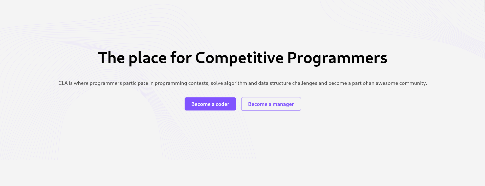
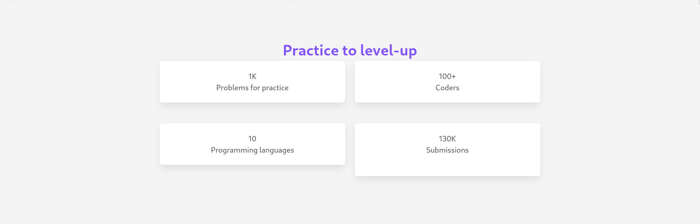
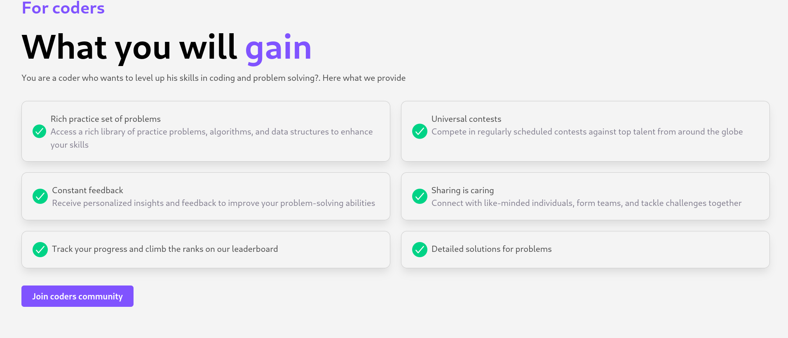
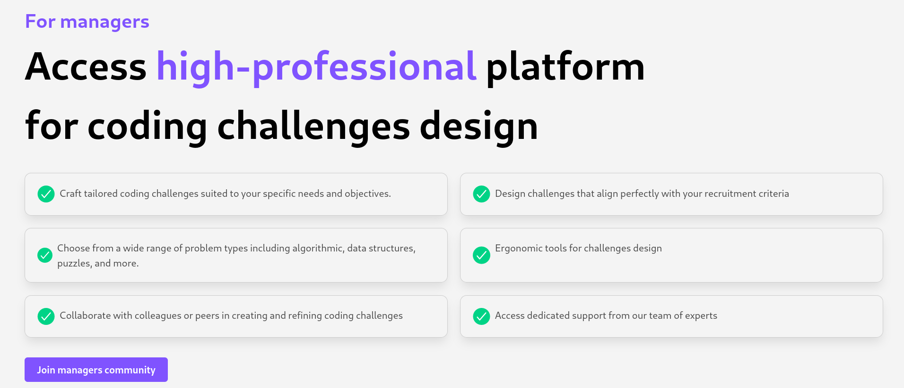
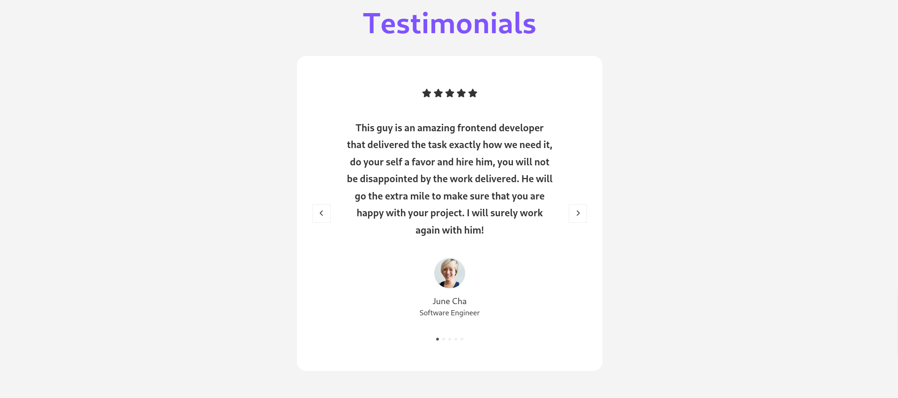
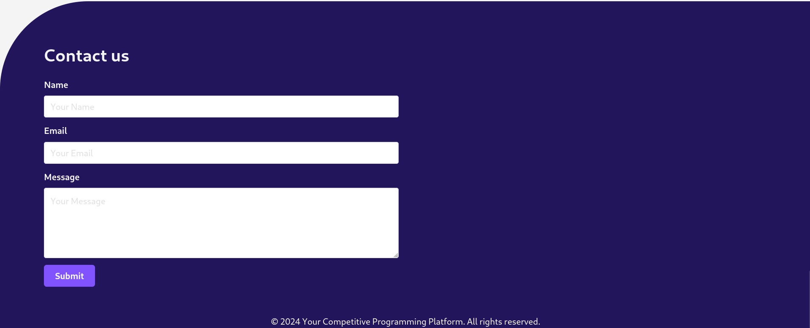

## HTML+CSS assignement
In the assignment you are going to use your knowledge
to build the html skeleton of the application's landing page.

The page you will be going to design is the following:

Before your start on your tasks, here are important things related color schemes and fonts

### Color Scheme:

- **Primary Color:** #8053FF
- **Main Body Color:** #23155B 
- **Gray Light Color:** #817d8e
- **White Color:** #f4f4f4 
- **Background Color:** #f4f4f4

### Font:

- **Font Family:** Martel Sans, sans-serif
  - **Weights Available:** 200, 300, 400, 600, 700, 800, 900
- **Alternative Font:** Noto Sans Khojki
  - **Weights Available:** Normal

### Tasks
The tasks are as follows:

#### 1. Landing page UI
- Implement the navigation bar section which contains a logo on the left and two links an a button to the right

- Implement the hero section which is the following:

- Implement the following section which demonstrates some statistics of the system:

- Implement the features section for coders:

- Implement the features section for the managers (aka challenge makers):

- Implement the show case section:

- Implement the testimonials section (Don't include the nagivation between testimonials, it will be added in your JS assignment):

- Implement the footer section (Dont't include form submission yet, it'll be added in the JS assignment):

- Implement mobile version of the landing page:

#### 2. Signup page UI

Next, you are asked to implement the the following signup page UI

#### 3. Signup page UI
Next, you are asked to implement the the following signup page UI
