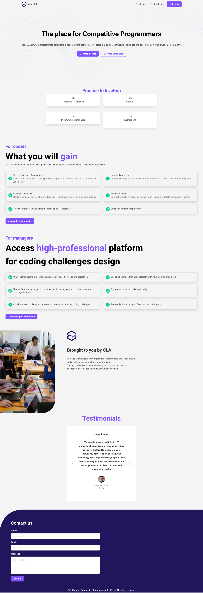
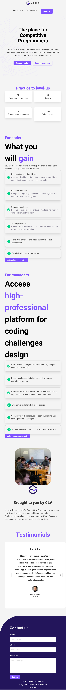
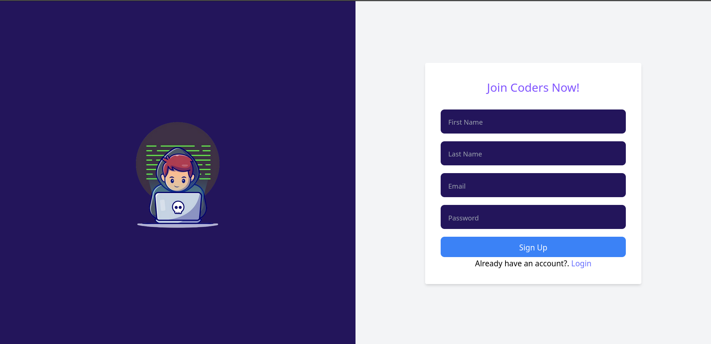
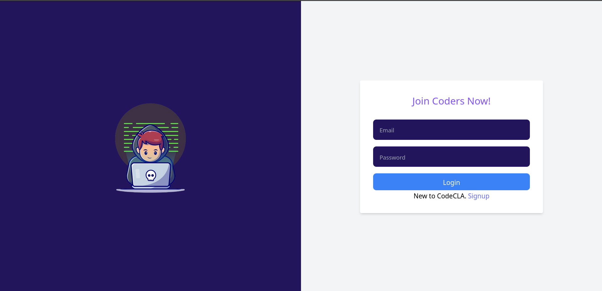

## Tailwind assignment
In this assignment, you are going to refactor your code and reimplement the page in [Tailwind CSS](https://tailwindcss.com/)

Here is reminder of the pages

### 1. Landing page UI (Desktop)

### 2. Landing page UI (Mobile)

### 3. Signup page UI

### 4. Signup page UI
