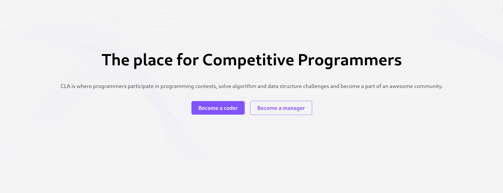
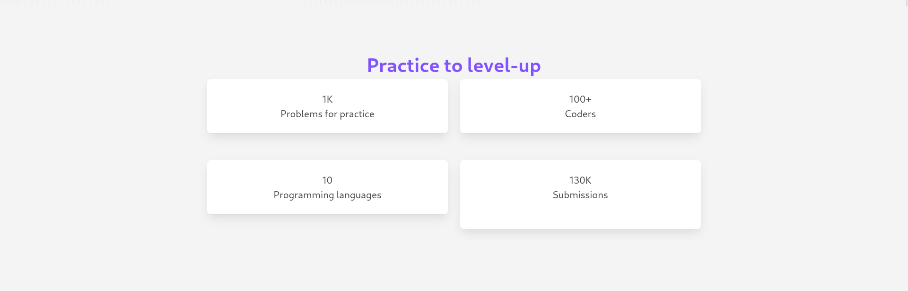
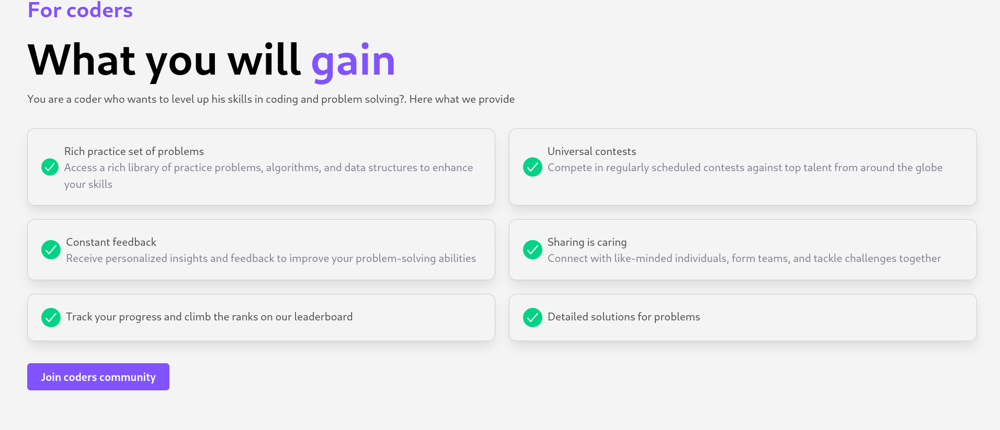
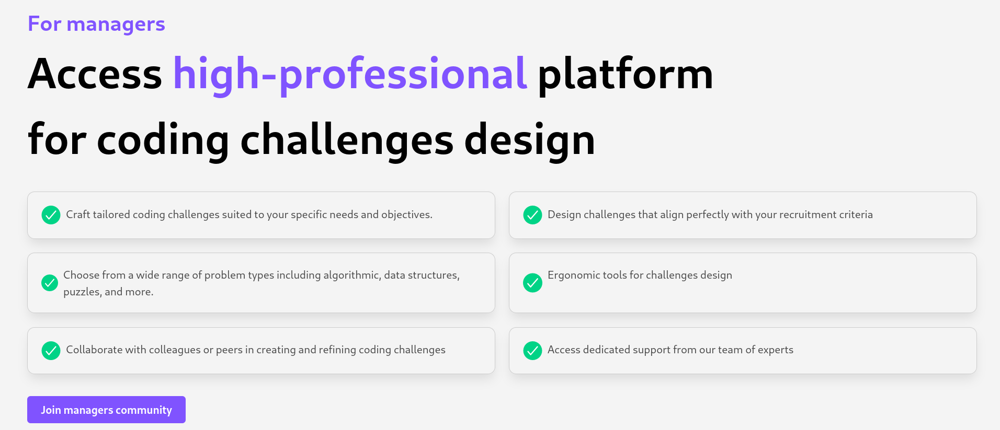
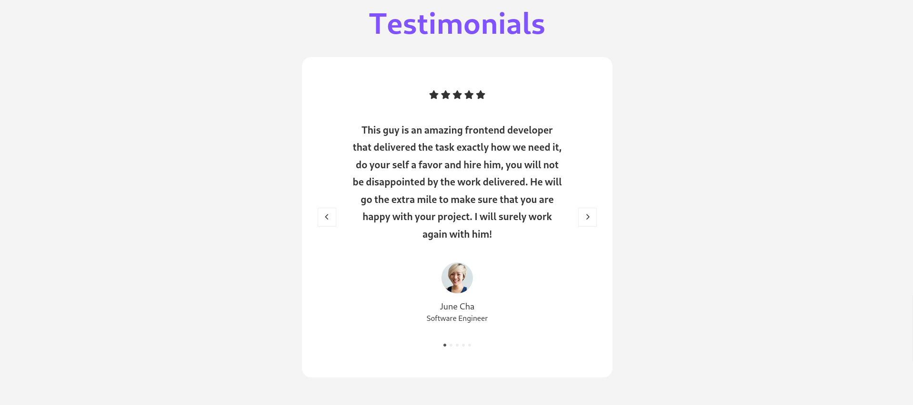
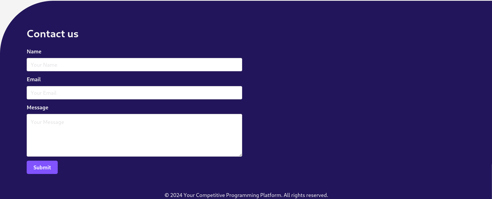

## HTML+CSS assignement
In the assignment you are going to use your knowledge
to build the html skeleton of the application's landing page.

<!-- TODO: Insert a link -->
You can find the final Figma design [here](https://shorturl.at/xGTZ6)

### Tasks
The tasks are as follows:

- Implement the navigation bar section which contains a logo on the left and two links an a button to the right

- Implement the hero section which is the following:

- Implement the following section which demonstrates some statistics of the system:

- Implement the features section for coders:

- Implement the features section for the managers (aka challenge makers):

- Implement the show case section:

- Implement the testimonials section (Don't include the nagivation between testimonials, it will be added in your JS assignment):

- Implement the footer section (Dont't include form submission yet, it'll be added in the JS assignment):

- Implement mobile version of the landing page