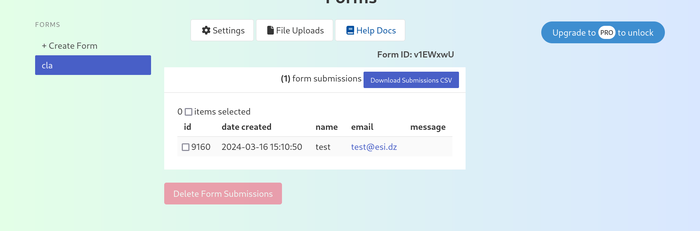
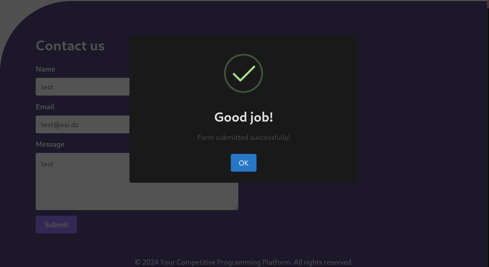

## Javascript assignement
In this assignment we're going to dynamicity to the webpage using javascript. Initially, you're going to implement the testimonials part then form submission.


Note:
The testomnials can be just hardcoded in your script

### Tasks
First we consider the following testomonials:
```json
[
  {
    name: "June Cha",
    position: "Software Engineer",
    photo: "https://randomuser.me/api/portraits/women/44.jpg",
    text:
      "This guy is an amazing frontend developer that delivered the task exactly how we need it, do your self a favor and hire him, you will not be disappointed by the work delivered. He will go the extra mile to make sure that you are happy with your project. I will surely work again with him!"
  },
  {
    name: "Iida Niskanen",
    position: "Data Entry",
    photo: "https://randomuser.me/api/portraits/women/67.jpg",
    text:
      "This guy is a hard worker. Communication was also very good with him and he was very responsive all the time, something not easy to find in many freelancers. We'll definitely repeat with him."
  },
  {
    name: "Renee Sims",
    position: "Receptionist",
    photo: "https://randomuser.me/api/portraits/women/8.jpg",
    text:
      "This guy does everything he can to get the job done and done right. This is the second time I've hired him, and I'll hire him again in the future."
  },
  {
    name: "Sasha Ho",
    position: "Accountant",
    photo:
      "https://images.pexels.com/photos/415829/pexels-photo-415829.jpeg?h=350&auto=compress&cs=tinysrgb",
    text:
      "This guy is a top notch designer and front end developer. He communicates well, works fast and produces quality work. We have been lucky to work with him!"
  },
  {
    name: "Veeti Seppanen",
    position: "Director",
    photo: "https://randomuser.me/api/portraits/men/97.jpg",
    text:
      "This guy is a young and talented IT professional, proactive and responsible, with a strong work ethic. He is very strong in PSD2HTML conversions and HTML/CSS technology. He is a quick learner, eager to learn new technologies. He is focused and has the good dynamics to achieve due dates and outstanding results."
  }
]
```

### Testimonial part
Implement dynamic testimonials:
1. If the user clicks on next or previous buttons, the next or previous testimonial appears.
2. Try to add infinit testomonial loop that changes each 5 seconds.

### Form submission
We want to collect our clients sent message, for this we are going to use an online tool that can be found [here](https://fabform.io). It's a tool that allows us to send form messages using http requests and then we can visualize them in their website.
1. Follow the docs to see how to make a request to their API when the user submits a message.



2. Now, try to add form submission on success alerts.

For this we use this [tool](https://sweetalert2.github.io/) which provides a variety of nice and sweet alerts.

